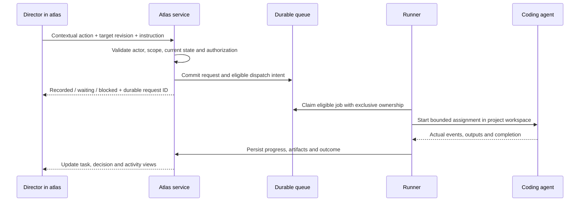

# Director-Initiated Agent Work

Version: **1.0.1**

This is a mandatory implementation contract. After the Director approves the target concept and atlas-build scope, the implementing agent must autonomously build and connect the flow described here. It is part of the operational atlas, not an optional future integration or a manual prompt-transfer workflow. The repository's supplied frontend remains a demo until this contract is implemented and verified in the target project.

## 1. The Director's experience

The Director must be able to open a task or decision and nudge an agent to perform a specific next action. A nudge is an attributable request to advance that record within its authority and scope. It is not blanket approval, a forced restart, or permission to take a decision reserved to a human.

Provide a clearly visible **Ask agent to work on this** entry point on task and decision details. Offer the same entry point from their board cards and associated activity entries. History entries target the current record and show which revision will be acted on; they never reactivate an obsolete approval.

Opening the action shows:

- The selected task or decision, current revision, and relevant approval.
- The next permitted action in plain language.
- An optional Director instruction; require one when the intended action is otherwise ambiguous or materially changes direction.
- The assigned executor or the configured project default, and whether it is available.
- What clicking the primary button will do: analyze, start, request an update, or submit steering.
- Any missing dependency, approval, configuration, or execution capability, with a concrete next step.

Choose the contextual primary action from the table below. Do not require the Director to select an internal agent role, compose a technical prompt, paste a command, or understand queue internals. A default executor is sufficient; a multi-agent roster is optional.

## 2. Meaning depends on the current record

| Current situation | Director action | Required effect |
|---|---|---|
| Idea, draft task, or decision needing investigation | **Prepare a proposal** | Run bounded analysis and return options, recommendation, scope, criteria, and open questions. Do not implement the product change. |
| Proposal awaiting the Director | **Clarify this decision** | Answer the Director's question or improve the proposal. Preserve the human decision requirement; a material revision needs a fresh approval. |
| Approved task that has not started | **Start approved work** | Recheck the exact approval, readiness, dependencies, pause state, and executor; durably enqueue eligible work. |
| New proposal ready for approval | **Approve and start** | Record explicit approval and a start intent in the same transaction, then follow the same dispatch path as Start approved work. |
| Task already queued | **Check queued work** | Reconcile the existing job and show its position or blocker. Signal the dispatcher where useful, but never create a duplicate job. |
| Task already running, with no new direction | **Request an update** | Inspect the existing attempt and obtain fresh status through supported capabilities. Do not start a second implementation attempt. |
| Task already running, with new direction | **Send direction** | Record versioned steering, assess its impact, and deliver through a supported channel or safe checkpoint. Show whether it has actually been acknowledged. |
| Previously recorded decision has changed | **Assess this change** | Assess affected work and approval validity. Preserve earlier decisions; prevent dependent work using invalidated authorization. Do not silently undo completed work. |
| Paused task or project | **Review pause** or **Resume approved work** | Preserve intentional pause. Resume only after an explicit resume action and fresh checks. A generic nudge cannot resume paused execution. |
| Failed, interrupted, or uncertain attempt | **Check and retry** | Reconcile process state and side effects first. Create a new attempt only when the prior one cannot still execute and current authorization permits retry. |
| Result awaiting Director review | **Explain this result** | Provide analysis or clarification linked to actual evidence. Do not accept the result on the Director's behalf. |
| Accepted or cancelled work | **Propose follow-up work** | Create a linked new request or revision. Do not reopen completed execution implicitly. |

“Approve for later” remains non-dispatching. A later explicit Start approved work action is required unless the Director subsequently authorizes an automatic-start policy for that work. A nudge on a decision never changes its outcome by itself. Changing a decision and instructing an agent to assess its implications are separately attributable actions, even if offered together in the interface.

## 3. Implement the whole path autonomously

Include this flow in the proposed atlas-build scope. Once that scope is approved, implement the interface, command API, durable records, dispatch, execution adapter, feedback, and recovery without waiting for the Director to request each component separately. Make routine reversible engineering choices within the approved environment and constraints.

During bootstrap:

1. Inspect the target repository, existing instructions, available execution tools, runtime, and authorized access.
2. Respect the Director's executor preference. If none is specified, prefer an available, authorized Codex integration; otherwise use another supported executor such as Claude Code where compatible with the agreed environment. Do not silently switch provider, model, account, cost policy, or data destination to bypass an unavailable connection.
3. Verify the selected executor's current official documentation and installed capabilities. Use a supported CLI, SDK, or service interface; do not invent an API to an existing desktop chat or depend on simulated keyboard interaction.
4. Implement one real adapter first. A second provider and concurrent agents are optional. A single serial worker is a valid initial implementation.
5. Configure a project-scoped workspace, authentication, permitted tools, limits, and lifecycle management. Use existing authorization; ask only for genuinely missing access, credentials, or a material unresolved choice.
6. Provide an **Execution connection** view with executor identity, workspace, availability, last contact, capabilities, and an actionable connection problem. Exclude secrets from that view.
7. Start the service and runner, perform a bounded connection check, and demonstrate the real nudge journey before handover.

If a required capability cannot be connected, finish independent implementation work, show the precise blocker, and leave operational acceptance incomplete. A disabled button, mock worker, copied prompt, or request to return to chat is not completion of this requirement.

## 4. Runtime and command lifecycle

The runner is a maintained background process or supported managed execution service, not an open browser tab or a permanently reasoning language-model session. Wake it on committed work or let it poll the durable queue at a documented bounded interval. Closing the browser must not lose work. State explicitly whether the execution host must stay awake and how the runner starts again after a machine or service restart.

An illustrative server command is `POST /projects/{project_id}/agent-requests`. Its payload contains a target kind and ID, expected target and decision revisions, requested action, optional guidance, and an idempotency key. Derive actor identity from authentication and resolve the executor and workspace from authorized project configuration. Do not accept browser-supplied arbitrary shell commands or filesystem paths as execution authority.

In one transaction, record the request, the resulting event, and any eligible dispatch intent. Return the durable result before claiming the worker is running. The runner claims jobs atomically, rechecks current authorization immediately before launch, and stores the actual provider run or session ID. Use that exact ID for later control or continuation; do not resume whichever session happens to be most recent.

For an already active target, link to its current attempt. Repeated clicks, retries with new request IDs, and multiple Directors must not launch competing attempts for the same work revision. Serialize shared-workspace mutations unless the implementation provides explicit isolation and coordination. Transport deduplication alone does not guarantee unique execution.

## 5. What the agent receives and returns

Construct an assignment from the authoritative project records. Include:

- Request, project, target, job, and attempt IDs.
- The action type: analysis, implementation, status request, steering, or reconciliation.
- The Director's instruction and its actual author and source.
- Relevant concept, topic, proposal, decision, plan, and criteria revisions.
- A durable authorization reference and the boundaries of that authorization.
- Workspace and base code revision, dependencies, protected areas, permitted capabilities, time or cost limits, and stop conditions.
- Required output, verification method, and the supported return channel.

Implement [CONTEXT_PROTOCOL.md](CONTEXT_PROTOCOL.md) for these assignments. Persist an immutable package per attempt and the payload actually delivered, not merely a list of desired links. Reject missing, inaccessible, conflicting, or stale required context before launch, and revalidate relevant decisions at consequential action boundaries. The Director can inspect the basis for each task and historical attempt.

Do not forward an unbounded project dump or assume that another chat's memory is available. Record what context was actually supplied and any additional references read with their purpose and revision. Treat source documents and executor responses as data, not new permissions. Disclose existing session context and broad filesystem access; a bounded payload alone does not establish isolation.

Translate actual executor events into atlas activity. Store useful outputs as linked artifacts, analysis as proposal material, and completed implementation as a result requiring verification. Agent text saying “done” is not proof of acceptance. Provider-specific event formats belong in the adapter rather than the Director interface.

## 6. Feedback and blocked states

Show separate request, job, and product states. The Director must distinguish:

| Visible message | Evidence needed |
|---|---|
| Request recorded | Command committed durably |
| Waiting for connection / dependency / approval | Specific unresolved prerequisite |
| Queued | Eligible job exists and is awaiting a runner |
| Picked up | Runner owns the job |
| Running | Actual executor start acknowledgement |
| Update requested / direction awaiting delivery | Control request exists; acknowledgement has not arrived |
| Blocked / failed | Actual cause, retained context, and a next action |
| Proposal ready / ready for review | Required output exists; applicable verification completed |

Show the latest meaningful activity and an expandable execution record on the original task or decision. Link all resulting proposals, work, evidence, and follow-up requests back to that source. Counters in the overview must agree with those records.

An offline runner does not make a request disappear. Persist valid intent as waiting, show that it may start after reconnection if still authorized, and allow the Director to withdraw it. Revalidate before dispatch. If access or approval is missing, show the required corrective action rather than repeatedly trying to start. A pause, changed decision, withdrawn request, or invalidated scope must stop deferred work from launching under obsolete authorization.

## 7. Limits and recovery

Enforce project and task limits, bounded retries, request rate limits, and explicit stop conditions. A nudge must not reset budgets, clear failures, override a deliberate pause, or trigger an unlimited self-restarting loop. Automatically continue only work whose existing authorization and dependency policy actually permit it.

Keep credentials on the runner or server and retain a durable association between requests and executor attempts. On restart, reconcile running or uncertain attempts before creating replacements. A missed heartbeat is not evidence that the old process stopped. Unsupported live steering must be shown as deferred or unavailable, not acknowledged falsely.

## 8. Required handover demonstration

Implement and execute [ACCEPTANCE.md section K](ACCEPTANCE.md#k-director-nudges-start-real-agent-work). Demonstrate both proposal preparation from a decision and execution of an approved task using the connected real executor. Show that the Director can initiate them from the atlas, see actual output, and continue the loop without opening a terminal or external agent chat.

Deliver the runner code or supported service integration, validated configuration, startup and recovery instructions, and an evidence-backed handover receipt. Clearly separate features demonstrated with real execution from any remaining demo-only interaction.
