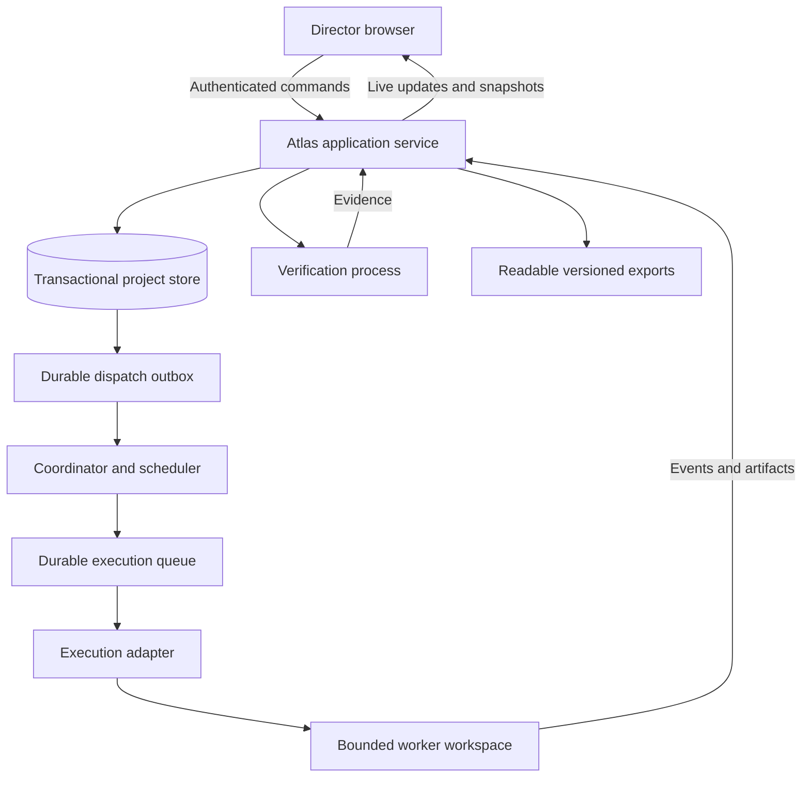

# Service Architecture

Version: **1.0.0**

This is a technology-neutral implementation contract. Select concrete tools during bootstrap based on the target environment. Do not claim that the components or integrations described here already exist in this repository.

## 1. Components

The coordinator may run inside the application service for the first implementation. Keep durable responsibilities explicit even if deployment uses one process. The queue can be database-backed; a separate queue platform is not mandatory.

Implement [AGENT_ACTIVATION.md](AGENT_ACTIVATION.md) end to end. A maintained runner or supported managed execution service must consume committed work through a documented wake-up or polling mechanism and invoke the configured real executor. Its lifetime is independent of the Director's browser and the original implementation chat. Include connection configuration, startup, health reporting, and restart recovery in the delivered application; do not leave the runner as a diagram-only component.

## 2. Authoritative storage

Before an atlas service exists, maintain the concept baseline, research, decisions, and Director approval in versioned project files. After explicit approval, seed the new service from those records. Preserve their original authorship, versions, and approval provenance. Verify the transfer at handover and retain the files as read-only historical snapshots; further operational edits go through the service.

The running service owns specifications, requests, proposals, decisions, work records, evidence metadata, acceptance records, and activity events. Use storage that supports transactions, unique constraints, and optimistic concurrency. Store large artifacts separately with immutable references, checksums, and appropriate access checks.

Code and build configuration remain in version control. The service stores the relevant commit or artifact fingerprint alongside execution and evidence. Topic specifications are versioned in the project store and can be exported to readable files and committed as snapshots.

Exports are not a second editable source. If file-based authoring is supported, import it as a version-checked proposal through the same command path. A background file overwrite must not silently bypass approvals or invalidate current jobs.

## 3. Command processing

Every mutating command includes an authenticated actor, project scope, command type, target ID, expected version, payload, and idempotency key. The server:

1. Checks access and action-specific authority.
2. Loads current records and validates expected versions.
3. Checks legal transitions, dependencies, and relevant approval scope.
4. Applies the mutation and writes its attributable event in a transaction.
5. Writes a dispatch intent in that same transaction when execution is authorized.
6. Returns the durable outcome and event position.

The dispatcher delivers committed intents with retry handling. Consumers deduplicate by stable intent and job IDs. Treat this as at-least-once transport with protected state transitions, not a claim of universally exactly-once external execution.

## 4. Example command surface

The following logical operations must be available through the UI. Route names are suggestions, not implemented endpoints.

| Operation | Example route | Essential checks |
|---|---|---|
| Request a topic change | POST /projects/{id}/requests | Topic access, actor, base version |
| Nudge an agent on a task or decision | POST /projects/{id}/agent-requests | Target and decision revisions, action scope, current approval, existing active attempt, idempotency |
| Withdraw a waiting agent request | POST /agent-requests/{id}/withdraw | Actor authority, request revision, dispatch race handling |
| Approve a proposal | POST /proposals/{id}/approve | Director authority, proposal version, start policy |
| Request proposal changes | POST /proposals/{id}/revise | Current proposal, recorded feedback |
| Start approved work | POST /work/{id}/start | Current authorization, readiness, dependencies |
| Steer active work | POST /work/{id}/steer | Work version, impact assessment, safe delivery |
| Pause or resume | POST /work/{id}/pause or /resume | Capability, current state, valid checkpoint |
| Cancel | POST /work/{id}/cancel | Authority, safe stop request, outcome tracking |
| Review a result | POST /results/{id}/review | Result and criteria versions, mandatory evidence |
| Read live activity | GET /projects/{id}/events?after={cursor} | Project access, ordered replay |
| Export a snapshot | GET /projects/{id}/export | Access scope, redaction policy, source version |

Rejected commands return a reason the Director can act on, such as “This proposal changed since you opened it; review version 4.” They must not partly apply the requested change.

## 5. Real execution adapter

Implement at least one real adapter before application v1 acceptance. Use capabilities genuinely exposed by the selected environment. An adapter can connect a local coding worker or another supported execution service; no particular vendor integration is assumed.

Its contract covers:

- Capability discovery: accepted task types, workspace access, pause/cancel behavior, evidence return, and constraints.
- Submit: a bounded assignment with stable job ID, authorization reference, input revisions, and limits.
- Status and reconcile: actual queued, running, terminal, or uncertain state.
- Events: start acknowledgment, heartbeat, milestones, blockers, outputs, and terminal result.
- Control: pause or cancel requests only where supported, with acknowledgment semantics.
- Artifacts: immutable result references, tested revision, and useful diagnostic information.

Record provider job IDs and attempt numbers. Distinguish “command accepted by the atlas” from “worker started” and “worker finished.” A worker cannot issue a Director approval. A self-reported success still requires the declared verification.

Use explicit provider session IDs for continuation, with current atlas context and authorization attached to each assignment. Verify actual installed capabilities and current official provider documentation during implementation. Do not assume that a repository link, browser event, MCP tool definition, or saved instruction automatically wakes an external agent. Prevent overlapping mutation jobs on the same workspace unless isolation is explicitly implemented.

Where a language-model worker is used, construct its assignment from approved records and project instructions. Treat arbitrary documents, page content, and worker output as data. They cannot grant permissions or change the approved scope.

## 6. Isolation and access

Authenticate the Director for mutations even in the first local implementation. Use appropriate session protection, server-side authorization, and request-forgery defenses for the chosen deployment. Do not expose execution control on an unauthenticated public URL.

Scope workers to required workspaces and tools. Keep execution credentials on the server or worker host, not in the browser, public exports, prompts, or logs. Give observation and execution access separate roles. Avoid exposing a general arbitrary-shell command endpoint to the Director interface.

External publication, sending messages, destructive operations, or broader access changes remain governed by actual user authorization and platform rules. An “approved” product proposal does not automatically authorize every possible side effect.

Serve artifact previews safely. Untrusted generated HTML should not execute with the atlas application's origin or credentials; use an appropriately isolated preview mechanism. Validate uploaded artifacts and restrict their visibility to the project.

## 7. Live views and consistency

Use a server event stream, WebSocket connection, or a reliable polling fallback. Each event has a monotonically ordered project sequence or equivalent replay cursor. The browser tracks the last confirmed sequence and refreshes after gaps.

Derive the map, counters, decision inbox, and work board from the same records. Publish state changes only after their transaction commits. Optimistic UI updates must revert on rejection and never show accepted completion before the server confirms it.

Use projections or caches for fast views when useful. Store their source position and rebuild them from authoritative records. A stale projection must be recoverable without losing operational state.

## 8. Reliability and recovery

Separate the life of an execution job from a browser tab or conversational turn. Store jobs durably and use worker leases with heartbeat and fencing tokens where multiple workers can claim work. A late worker with an expired lease cannot overwrite a newer attempt's state.

On restart, reconcile pending intents, claimed jobs, pause requests, and incomplete acceptance transactions. Preserve uncertain side effects for investigation. Use bounded retries and expose persistent errors rather than retrying forever.

Back up operational records and artifact references. Document restoration and test it before claiming recovery acceptance. A source-code checkout alone does not restore Director decisions or active jobs.

## 9. Bootstrap and operational handover

First complete CONCEPT.md and record the Director's explicit approval. Project preparation and conceptual research precede service construction. The approved baseline determines the atlas's initial product topics, decisions, constraints, and milestone scope.

Record chosen components, launch steps, configuration requirements, storage location, credential handling, backup procedure, and actual executor capabilities. Use a small non-destructive assignment to test the connection.

Verify the service's content against the approved baseline, including the original concept approval. Then perform a real Director iteration within approved scope through the atlas and retain its evidence. Handover is complete only when ordinary direction, execution, progress, and review no longer need an external chat or manual file edit.

## 10. Publishing and visibility

Running a private project service and publishing a public atlas are separate operations. v1 requires the operational service, not public hosting.

If read-only public sharing is added, build a scoped projection that excludes private records, execution controls, credentials, internal artifacts, and hidden search data. Mark it as a dated snapshot when it is not live. Do not expose operational routes merely because public documentation is available.
