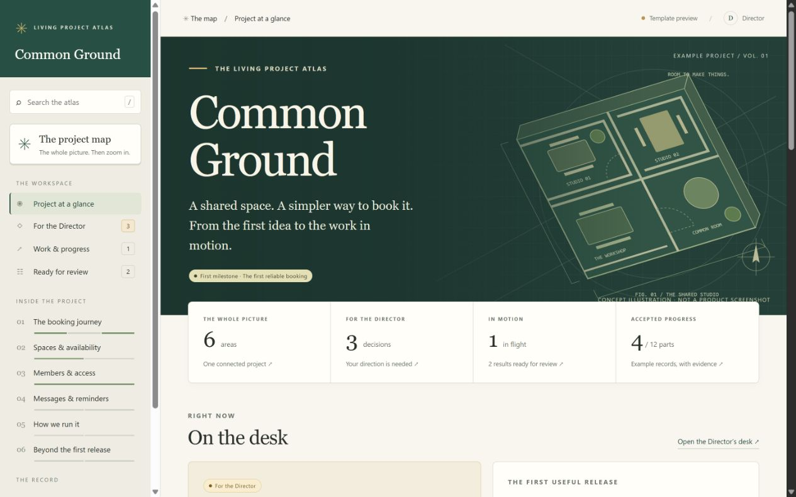
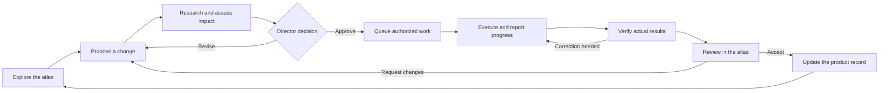

# Living Project Atlas

**Understand the project. Direct the work. See the evidence. Keep improving.**

Version **1.0.1** · [MIT license](LICENSE)

Living Project Atlas is a method, specification, and reusable visual template for a project workspace that also runs the project's execution process. It brings product knowledge, decisions, work, evidence, and progress into one web service.

The human **Director** explores the project, approves proposals, changes direction, and reviews results inside the atlas. A coordinator turns that direction into bounded work, dispatches it through a real execution connection, checks the outcome, and updates the same workspace.

**First agree on the concept; then build the atlas; then direct the project through it.** The Director gives explicit approval of the conceptual foundation before the atlas is built. After operational handover, the atlas is the primary interface for subsequent execution and iteration.

> **Starting a project with an agent? Begin at [START.md](START.md).** It is the single entry point. Follow its phase reading route; do not preload this repository or recursively follow its links. This README is an overview for people.

## What this release contains

This repository contains the **v1 specification, implementation brief, and runnable visual template**. The template includes a project overview, interactive map, topic chapters, Director decisions, work board, result reviews, conceptual baseline, search, and history. It uses an explicitly fictional example project, Common Ground, to demonstrate the structure.

The template runs locally and stores demo interactions in the browser. It does **not** include an operational database, authentication, connected execution backend, or verified product implementation. A resulting application may claim v1 implementation complete only after meeting [ACCEPTANCE.md](ACCEPTANCE.md), including real execution from the atlas.

## Use, limitations, and responsibility

Living Project Atlas provides a method, specification, and demonstration template. It does not guarantee project outcomes, correct agent behavior, security, or suitability for a particular purpose. The software and accompanying documentation are provided "as is", without warranties, under the [MIT license](LICENSE), which also contains a limitation of liability. These provisions apply only to the extent permitted by applicable law; they do not exclude liability that cannot lawfully be excluded.

Users and implementers are responsible for evaluating suitability for their use case, securing their own implementation, configuring agent permissions and access to data, and independently checking generated code, decisions, and results before relying on them. Director approval and passing the example tests do not establish that a system is safe, legally compliant, or ready for production.

Before connecting agents to real systems, use appropriately limited permissions, test in an isolated environment, protect credentials and personal data, and provide backups and recovery procedures. Obtain appropriate professional review where a failure could have significant consequences. The included template is a local demonstration, not a production service; implementation requirements in this repository describe work that still needs to be built and verified for each project.

## Try the visual template

With Node.js 20 or later installed, run from the repository root:

```sh
cd template
npm start
```

Open **http://127.0.0.1:4173**. No dependency installation is needed. Run `npm test` inside `template` to check the demo transition rules. See [VISUAL_TEMPLATE.md](VISUAL_TEMPLATE.md) for the layout, customization guide, and path to an operational service.

The reusable frame is already built. For a new project, previewing it is allowed during concept discussion; tailoring and connecting the project's operational atlas still starts only after the Director approves its conceptual baseline.



## Start a project with this repository

```text
Start this project using Living Project Atlas:
https://github.com/Appie-NL/living-project-atlas/blob/main/START.md

Read START.md first. Resolve the method version and repository commit, then
read only the current phase entry and its required references from that commit.
Do not scan the full method repository, recursively follow links, or open a
next-phase entry before its transition condition is met and recorded.

Project: [name and workspace]
Purpose: [the outcome I want]
Users: [who the product serves]
First useful capability: [one small end-to-end outcome]
Constraints: [scope, environment, time, budget, language]

Prepare the workspace and help me refine the concept. Do not build the atlas
until I explicitly approve the current conceptual baseline and bounded build
scope. After verified, accepted handover, manage execution and iteration
through the atlas, including contextual requests to real agents.
```

Repository access must actually be available. If the assistant cannot read a required file, provide a local copy. Record the specification version and revision used by the target project.

## Reading by phase

`START.md` keeps a small fixed core active and routes new projects to concept development. Each phase entry defines required reading, optional references, durable context, and a conditional link to the next phase. Concept approval unlocks the build instructions; verified and Director-accepted handover unlocks operation. Operational assignments receive selected, versioned context from the atlas. Links alone do not authorize advancing a phase.

This is a reading protocol, not a filesystem access restriction. An adapter with broad repository access can still read other files; the implemented atlas must disclose that limitation and use supported access controls where appropriate. See [CONTEXT_PROTOCOL.md](CONTEXT_PROTOCOL.md) during implementation.

## From idea to operational atlas

| Stage | Main activity | Where it happens | Required outcome |
|---|---|---|---|
| Prepare | Set up the project context and working records | Initial conversation and workspace | Ready to develop the concept |
| Develop the concept | Director sets the frame; assistant researches, compares, challenges, and refines | Initial conversation and versioned brief | Reviewable conceptual baseline |
| Director approval | Agree that the idea and direction are sufficiently developed | Explicit recorded Director response | Permission to build the bounded atlas |
| Build the atlas | Turn the approved concept into a tailored operational service | Bootstrap work within approved scope | Working service with real execution |
| Hand over | Demonstrate and verify a full project iteration | Atlas web interface | Operational handover accepted |
| Continue | Propose, decide, execute, verify, review, and iterate | Atlas web interface | Updated product knowledge and visible progress |

See [CONCEPT.md](CONCEPT.md) for the mandatory pre-build process. Conceptual approval is a human decision; technical readiness checks do not replace it.

## The Director's experience after handover

| In the atlas | What the Director can do | What happens behind it |
|---|---|---|
| Project overview | Understand the product, its current state, and next priorities | Views are built from authoritative project records |
| Decisions inbox | Approve a recommendation, choose an alternative, or request changes | A versioned decision is recorded and eligible work is released |
| Topic page | Explore a feature and request a specific improvement | A scoped proposal links back to that feature and its dependencies |
| Execution board | Follow progress, inspect blockers, reprioritize, pause, resume, or cancel | Durable jobs and workers report their actual state |
| Review page | Inspect a preview and evidence; accept or return the result | Acceptance or rework is recorded against the exact result |
| Activity and history | See what changed, why, and who decided | An attributable event trail preserves the project history |

Approving a proposal can start its authorized execution automatically. The interface must say whether approval starts work or only records a choice. Approval is not proof that the work succeeded.

Tasks and decisions must also offer **Ask agent to work on this**, with a contextual next action and visible feedback. The implementing agent must build and connect this flow after concept approval, following [AGENT_ACTIVATION.md](AGENT_ACTIVATION.md). A maintained runner activates the configured executor when an authorized request is ready. The Director can initiate analysis or execution from the atlas without copying prompts into a separate chat. These operational controls are required in the target implementation; the bundled local preview does not yet execute agents.



## Core principles

- Make the product understandable through meaningful visuals and plain language.
- Research credible alternatives before committing to consequential choices.
- Check readiness before execution and require evidence before acceptance.
- Keep intended behavior, observed behavior, and proposed changes distinct.
- Record human direction and automated actions in the same project history.
- Derive progress from actual work and verification; never simulate successful execution.
- Preserve context across sessions, worker failures, and service restarts.
- Match the amount of process to the size and consequence of the work.

## Read the specification

| File | Purpose |
|---|---|
| [START.md](START.md) | Single agent entry point, fixed rules, and phase selection |
| [CONTEXT_PROTOCOL.md](CONTEXT_PROTOCOL.md) | Versioned task context, validation, delivery, and recovery |
| [PROMPT.md](PROMPT.md) | Build-phase instructions, loaded after concept approval |
| [CONCEPT.md](CONCEPT.md) | Joint concept development and explicit Director approval before the atlas build |
| [PRODUCT_SPEC.md](PRODUCT_SPEC.md) | Product scope, Director experience, and v1 boundaries |
| [WORKFLOWS.md](WORKFLOWS.md) | Approval, execution, steering, verification, and recovery behavior |
| [ARCHITECTURE.md](ARCHITECTURE.md) | Web service, storage, command processing, workers, and security |
| [AGENT_ACTIVATION.md](AGENT_ACTIVATION.md) | Mandatory task and decision nudges, real runner integration, and Director feedback |
| [DATA_MODEL.md](DATA_MODEL.md) | Records, revision rules, state machines, and progress semantics |
| [TEMPLATES.md](TEMPLATES.md) | Reusable briefs, proposals, evidence, and review records |
| [VISUAL_TEMPLATE.md](VISUAL_TEMPLATE.md) | Runnable visual frame, design structure, customization, and service integration |
| [template/README.md](template/README.md) | Local preview and source file guide |
| [ACCEPTANCE.md](ACCEPTANCE.md) | End-to-end implementation acceptance scenarios |
| [EXAMPLE.md](EXAMPLE.md) | One complete project iteration through the atlas |
| [AGENTS.example.md](AGENTS.example.md) | Short bootstrap for a target workspace |
| [CHANGELOG.md](CHANGELOG.md) | Documentation release history |

## Implementation approach

After concept approval, adapt the included visual template and start with one Director, one project, one coordinator, and one real execution adapter. Build a narrow working route based on the approved scope before adding more automation or workers. Use the environment's available stack and supported execution capabilities; record the choice and its constraints. The dependency-free preview does not prescribe the production stack.

Initial setup may require a chat or terminal for installation, credentials, configuration, and connecting the first worker. Complete the handover only after the Director can run a real project iteration from the web interface. Routine work then stays in the atlas. Exceptional recovery and credential maintenance remain explicit operator tasks, with their outcomes recorded in the atlas.

The atlas remains understandable if execution is disconnected: show the outage, preserve proposals and decisions, and prevent misleading start or success indicators.

## Project adoption

Keep a reviewed copy of these files in the target workspace, record its version, and merge [AGENTS.example.md](AGENTS.example.md) into existing project instructions if appropriate. A repository link alone does not save persistent instructions or provide execution permissions. Confirm what is actually loaded and connected.

Before the service exists, the versioned brief and recorded Director approval preserve the conceptual baseline. At handover, load and verify those records in the service and retain the initial files as historical snapshots. The running service then owns operational records, specifications, decisions, and job state. Source code remains in version control; readable exports are not a second editable operational database.
